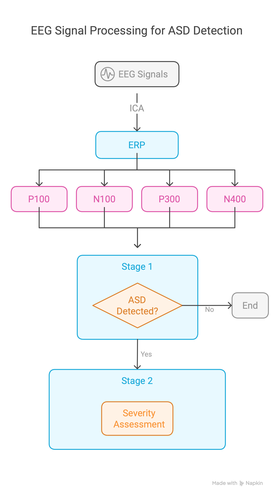
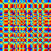
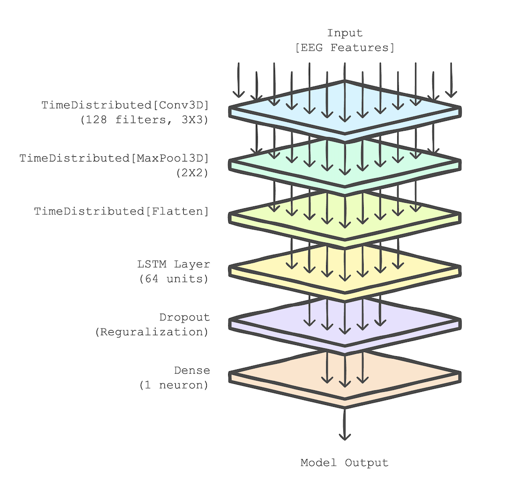
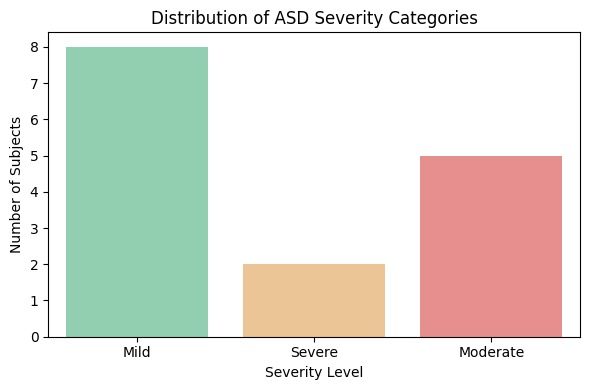
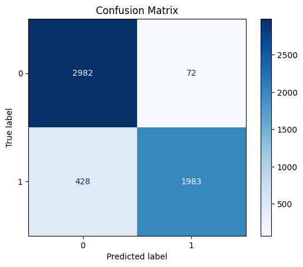
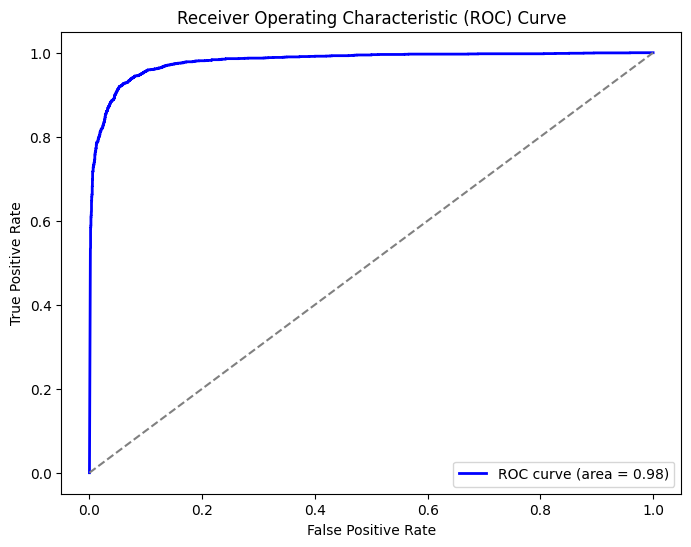
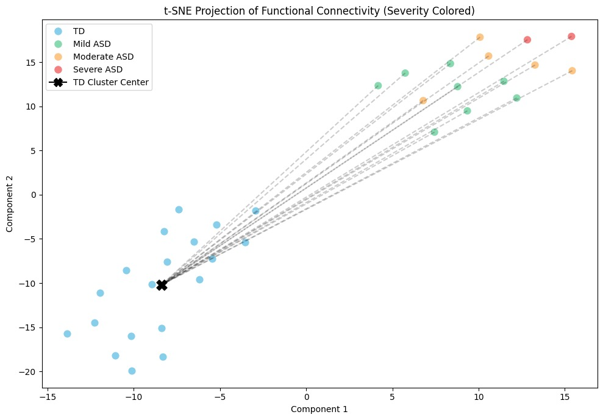
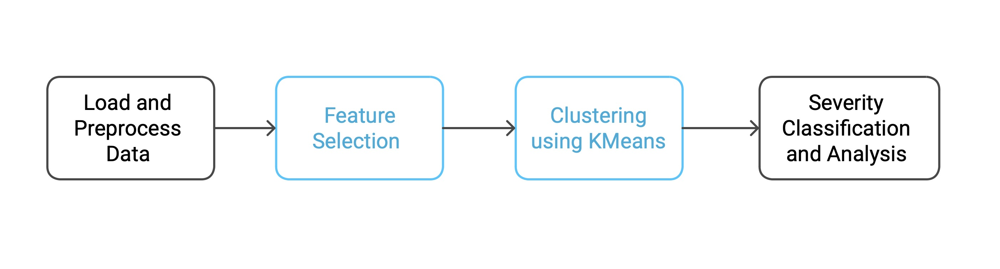

# 🧠 EEG-Based Autism Spectrum Disorder (ASD) Detection and Severity Classification

This repository contains the implementation of a two-stage deep learning system for **EEG-based ASD detection and severity classification**.
The project leverages **brain functional connectivity (BFC)** features derived from EEG signals, combined with **CNN–LSTM architectures**, to achieve high-accuracy classification.

---

## 📑 Table of Contents

* [Overview](#overview)
* [Methodology](#methodology)
* [Pipeline](#pipeline)
* [Visualizations](#visualizations)

  * [EEG Preprocessing](#1-eeg-preprocessing)
  * [Functional Connectivity](#2-functional-connectivity)
  * [Grayscale Image Construction](#3-grayscale-image-construction)
  * [Model Architecture](#4-model-architecture)
  * [Training Performance](#5-training-performance)
  * [Classification Results](#6-classification-results)
* [Requirements](#requirements)
* [How to Run](#how-to-run)
* [Results](#results)
* [Citation](#citation)

---

## 🔍 Overview

* **Stage 1**: Binary classification of ASD vs. Typically Developing (TD) individuals.
* **Stage 2**: Severity classification of ASD into sub-groups based on EEG patterns.
* **Key Features**: EEG preprocessing, brain functional connectivity (Pearson correlation), grayscale image representation, CNN–LSTM deep learning, hyperparameter tuning, and statistical validation.

---

## ⚙️ Methodology

1. **EEG Preprocessing**

   * Artifact removal, filtering, and segmentation.
2. **Functional Connectivity Analysis**

   * Pearson correlation of EEG channel pairs.
3. **Feature Transformation**

   * Normalized BFC matrices → converted to grayscale images.
4. **Deep Learning Model**

   * CNN–LSTM hybrid network trained on connectivity images.
5. **Evaluation**

   * Accuracy, Precision, Recall, F1-score, ROC-AUC.

---

## 🔗 Pipeline



---

## 📊 Visualizations

### 1. EEG Preprocessing

* Raw EEG vs. filtered EEG signal

---

### 2. Functional Connectivity

* Brain Functional Connectivity (BFC) matrices
  

---

### 3. Image Construction

* Normalized connectivity matrix → representation

---

### 4. Model Architecture

* CNN–LSTM hybrid model for classification
  

---

### 5. Training Performance

* Loss and accuracy curves during training
  

---

### 6. Classification Results

* Confusion Matrix (Stage 1: ASD vs. TD)
  

* ROC Curve & AUC
  

* Severity Classification Results (Stage 2)
  
  
  


---

## 📦 Requirements

* Python 3.8+
* TensorFlow / Keras
* NumPy, SciPy, Pandas
* Matplotlib, Seaborn
* Scikit-learn

Install dependencies:

```bash
pip install -r requirements.txt
```

---

## ▶️ How to Run

1. Clone the repository:

```bash
git clone https://github.com/yourusername/asd-eeg-detection.git
cd asd-eeg-detection
```

2. Preprocess EEG data and generate functional connectivity matrices.
3. Train the CNN–LSTM model using:

```bash
python train.py
```

4. Evaluate the model:

```bash
python evaluate.py
```

---

## 📈 Results

* High accuracy in ASD detection (Stage 1).
* Robust severity classification performance (Stage 2).
* ROC-AUC: \~0.98 (Stage 1).

---

## 📚 Citation

If you use this work, please cite accordingly
